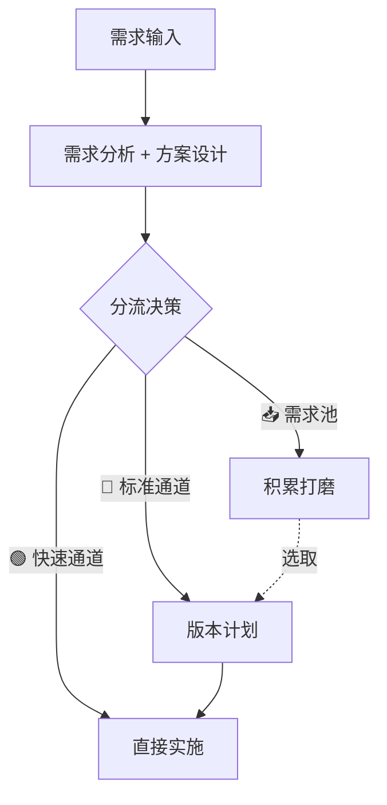
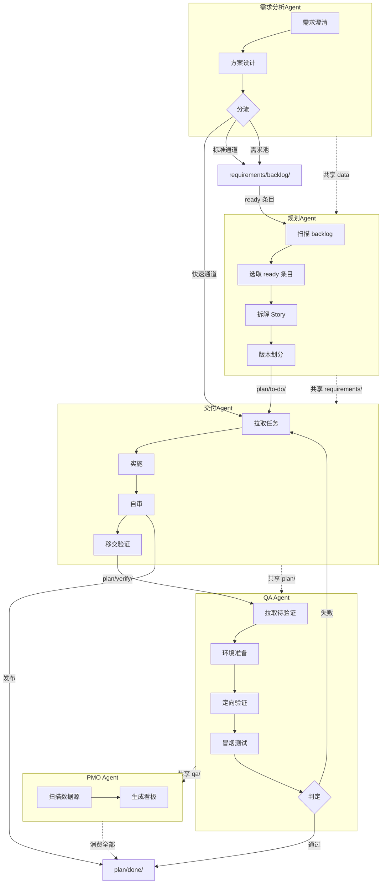

# 轻量级企业迭代开发方法论（Lean Enterprise Iteration）

> 适用于个人/小团队产品开发的工程方法论。继承 Agile 精神，融合企业级质量门禁与可追溯性，同时保持轻量——每个仪式都有实际价值，不为流程而流程。

---

## 角色定义

即便是单人项目，也需在迭代过程中切换以下角色视角，确保多维度思考。

| 角色 | 职责 |
|------|------|
| **产品负责人（PO）** | 定义需求、排优先级、验收结果 |
| **开发者（Dev）** | 方案设计、编码实现 |
| **质量保证（QA）** | 测试设计、独立验证、环境管理、质量门禁判定 |
| **运维（Ops）** | 数据安全、向后兼容、发布记录 |
| **PMO** | 项目状态汇总、看板维护、异常预警 |

> 角色冲突警示：当同一个决策从 PO 视角看合理，但从 Dev 视角看有隐患时，必须优先考虑数据安全和向后兼容原则。

---

## 关联参考

本文件是方法论总纲。以下内容在独立参考文件中定义，各 Agent 实施时以此为唯一标准：

| 文件 | 内容 |
|------|------|
| [`governance/design-principles.md`](governance/design-principles.md) | 核心哲学（五条价值观）、编码规范、设计原则、测试策略、沙箱隔离规则 |
| [`governance/risk-and-exceptions.md`](governance/risk-and-exceptions.md) | 风险管理框架、ADR 模板与触发条件、Hotfix 流程、回滚策略、禁止事项 |
| [`governance/project-init.md`](governance/project-init.md) | 项目接入治理规则：初始化前置条件、触发流程、约束与边界 |
| [`agent-analyst/requirements-analysis.md`](agent-analyst/requirements-analysis.md) | 需求分析Agent 详细流程：需求澄清、方案设计、分流决策、backlog 条目格式 |
| [`agent-planner/version-planning.md`](agent-planner/version-planning.md) | 规划Agent 详细流程：backlog 选取、Goal→Epic→Story 拆解、版本划分 |
| [`agent-deliverer/implementation.md`](agent-deliverer/implementation.md) | 交付Agent 详细流程：任务拉取、实施规范、自审清单、发布流程 |
| [`agent-qa/quality-assurance.md`](agent-qa/quality-assurance.md) | QA Agent 详细流程：环境准备、定向验证、冒烟测试、报告格式 |
| [`agent-pmo/reporting.md`](agent-pmo/reporting.md) | PMO Agent 详细流程：数据源扫描、看板生成、指标计算 |
| [`foundations/project-init-template.md`](foundations/project-init-template.md) | 项目初始化操作模板：`project-basic.md` 完整模板、章节说明、目录初始化命令 |

---

## 项目基本信息文件

采用本方法论的项目，须在根目录创建 `project-basic.md`，集中定义项目上下文。各 Agent 启动时首先读取此文件。

**必填章节**：项目标识（名称、根目录）、功能模块开关、目录结构、技术栈、关键规则、命令/API 参考

**按需章节**：战略主题（Initiatives，用于跨版本聚合需求）、数据模型（核心实体、字段、关联关系）

> 详细模板和初始化流程见 [`foundations/project-init-template.md`](foundations/project-init-template.md)。初始化治理规则见 [`governance/project-init.md`](governance/project-init.md)。

### 功能模块开关

三个可选能力通过 `project-basic.md` 的 `## 功能模块` 节控制：

**`branch-management`**
- `enabled: false`（默认）：目录隔离，环境在 `envs/{env}/` 下
- `enabled: true`：Git 分支隔离，需配置 `remote`

**`security-testing`**
- 启用后，QA Agent 执行安全渗透测试，产出写入 `qa/pen-test-reports/`

**`stress-testing`**
- 启用后，QA Agent 执行压力测试，产出写入 `qa/stress-test-reports/`

---

## 标准目录结构

### 目录树

公共部分（`define/`、`data/`、`requirements/`、`plan/`、`qa/`、`function-testing/` 等）两种模式共享。

**模式 A：目录隔离（`branch-management.enabled = false`，默认）**

```
<project>/
├── define/                         # 领域定义（数据结构、ADR）
│   ├── <entity>.md
│   └── adr/
├── data/                           # 实际数据
│   ├── <entity>.json
│   ├── enum-dictionary.json
│   └── .backup/
├── src/ 或 scripts/                # 源代码
├── requirements/                   # 需求文档
│   ├── requirements.md
│   ├── scenario.md
│   └── backlog/
├── change-log/                     # 变更记录
├── versions/                       # 版本路线图
│   ├── roadmap.md
│   └── v{x.y.z}.md
├── plan/                           # 版本实施计划
│   ├── to-do/v{N}/
│   ├── verify/v{N}/
│   └── done/v{N}/
├── pmo/                            # PMO 看板
│   └── dashboard.md
├── qa/                             # QA 报告
│   ├── function-test-reports/
│   ├── pen-test-reports/           # ← security-testing 启用时
│   ├── stress-test-reports/        # ← stress-testing 启用时
│   └── metrics.md
├── function-testing/               # 功能测试
│   ├── test-case.md
│   └── test-runner.<ext>
├── envs/                           # 多环境（模式 A 特有）
│   ├── dev/{data,config}/
│   ├── qa/{data,config}/
│   ├── stg/{data,config}/
│   ├── prod/{data,config}/
│   ├── hotfix/{data,config}/
│   ├── pen-test/{data,config}/     # ← security-testing 启用时
│   └── stress-test/{data,config}/  # ← stress-testing 启用时
├── .claude/
│   └── settings.json
└── project-basic.md
```

**模式 B：分支隔离（`branch-management.enabled = true`）**

环境通过 Git 分支隔离，不创建 `envs/` 目录。项目级 `data/` 和 `config/` 随分支切换。

```
<project>/
├── define/                         # （同模式 A）
├── data/                           # 实际数据（随分支切换）
├── src/ 或 scripts/
├── requirements/
├── change-log/
├── versions/
├── plan/
│   ├── to-do/v{N}/
│   ├── verify/v{N}/
│   └── done/v{N}/
├── pmo/
│   └── dashboard.md
├── qa/
│   ├── function-test-reports/
│   ├── pen-test-reports/           # ← security-testing 启用时
│   ├── stress-test-reports/        # ← stress-testing 启用时
│   └── metrics.md
├── function-testing/
├── .claude/
│   └── settings.json
└── project-basic.md                # 含 remote 地址
```

### 环境隔离与晋升规则

核心 5 环境始终存在：`dev`、`qa`、`stg`、`prod`、`hotfix`。`pen-test`、`stress-test` 由模块开关控制。

**代码晋升流**：

```
dev ──▶ qa ──▶ stg ──▶ prod
 ↑                        │
 └────── hotfix ◀─────────┘
```

**晋升规则**：
- `dev`：日常开发入口，所有功能分支合并到 `dev`
- `dev → qa`：功能开发完成后，交付Agent 执行
- `qa → stg`：门禁 4 通过后，QA Agent 执行
- `stg → prod`：UAT 通过后，交付Agent 执行发布
- `pen-test` / `stress-test`：从 `qa` 分出，QA Agent 独立管理，**不上游合并**
- **Hotfix**：`prod` → `hotfix` → 修复 → 合并回 `prod` + `dev`
- **禁止** `dev → prod` 直接合并（必须经 `qa → stg → prod`）

模式 A（目录隔离）中，晋升 = 目录间数据同步 + 分支合并；模式 B（分支隔离）中，晋升 = 分支合并。

### 目录与 Agent 的映射关系

| 活动 | Agent | 轨道 | 读取目录 | 写入/产出目录 |
|------|-------|------|---------|-------------|
| 需求分析 | 需求分析 | 全部 | `requirements/`、`function-testing/` | `requirements/` |
| 方案设计 | 需求分析 | 全部 | `define/`、`data/`、源码目录 | `define/`（含 `adr/`）、`data/enum-dictionary.json` |
| 版本计划 | 规划 | 标准 | `requirements/`、`function-testing/`、`versions/`、`requirements/backlog/` | `plan/to-do/`、`versions/roadmap.md`、`versions/v{x.y.z}.md`、`requirements/requirements.md`、`requirements/scenario.md` |
| 实施 | 交付 | 快速 + 标准 | `plan/to-do/`（标准）、`define/`、源码目录、`data/` | 源码目录、`data/`、`data/.backup/`、`plan/verify/` |
| 验证 | QA | 快速 + 标准 | `plan/verify/`、`function-testing/`、`envs/qa/` | `qa/function-test-reports/`、`qa/metrics.md`、`plan/done/`、`envs/qa/` |
| 发布 | 交付 | 快速 + 标准 | `project-basic.md`、`change-log/`、`versions/`、`qa/function-test-reports/` | `project-basic.md`、`change-log/`、`versions/v{x.y.z}.md`（更新） |
| 环境管理 | QA | 全部 | `envs/`、`data/` | `envs/qa/{data,config}/` |
| 需求池写入 | 需求分析 | — | `requirements/backlog/` | `requirements/backlog/`（新增、精炼条目文件） |
| 需求池选取 | 规划 | 标准 | `requirements/backlog/` | `requirements/backlog/`（标记 planned） |
| 看板更新 | PMO | 全部 | `requirements/backlog/`、`plan/to-do/`、`plan/verify/`、`plan/done/`、`versions/`、`change-log/`、`qa/` | `pmo/dashboard.md` |

---

## 双轨工作模型

并非所有变更都需要完整的 6 阶段流程。本方法论提供两条实施轨道 + 一个需求缓冲区：

### 轨道总览



### 轨道对比

| 维度 | 🟢 快速通道 | 🔵 标准通道 | 📥 需求池 |
|------|-----------|-----------|----------|
| **适用场景** | 小增补，立即要 | 中大型变更，需规划 | 暂不实施，积累打磨 |
| **判定条件** | ≤ 2 文件、无数据迁移、无新实体 | 不满足快速条件 | 用户明确表示"先记下来" |
| **版本计划** | 跳过 | 完整执行 | 暂不触发 |
| **plan/to-do/** | 不产生 | 产生 Plan 文件 | 不产生 |
| **门禁** | 1(轻量) + 2 + 4 + 5 | 全部 5 道 | 无（仅记录） |
| **版本号** | PATCH 递增 | 语义化版本 | 无 |
| **可追溯** | requirements + scenario + qa/function-test-reports + change-log | 完整追溯链 | backlog 条目 |
| **QA Agent** | 轻量验证（合并验证 + 冒烟） | 完整验证（逐 Story + 安全/压力测试） | 不涉及 |

### 分流决策

方案设计完成后，需求分析Agent 判断变更去向，三选一：

| 去向 | 条件 | 后续 |
|------|------|------|
| 📥 **需求池** | 用户不要求立即实施 | 条目保持 `ready`，等待规划Agent 选取 |
| 🟢 **快速通道** | 用户要求立即实施 + 满足全部 4 个快速条件 | 跳过版本计划，直接对接交付Agent |
| 🔵 **标准通道** | 用户要求立即实施 + 不满足快速条件 | 进入版本计划，由规划Agent 选取 |

快速通道条件（全部满足才可走）：

- [ ] 变更文件数 ≤ 2
- [ ] 无数据迁移（不改已有数据文件的字段结构）
- [ ] 无新实体（不新增 define/ 下的实体定义文件）
- [ ] 无破坏性变更（不影响已有 API/命令签名）

> 详细分流流程（含各去向后续动作）见 [`agent-analyst/requirements-analysis.md`](agent-analyst/requirements-analysis.md)「分流决策」章节。
>
> **快速通道 ≠ Hotfix**：快速通道是计划内小变更的轻量路径，Hotfix 是紧急修复的例外流程（见 [`governance/risk-and-exceptions.md`](governance/risk-and-exceptions.md)）。快速通道仍需完整的需求记录和测试。

---

## 门禁体系

5 道门禁是质量保障的核心机制。每道门禁有明确的检查项、通过标准和唯一执行者。

### 门禁定义

| 门禁 | 名称 | 检查项 | 通过标准 | 执行者 |
|------|------|--------|---------|--------|
| **门禁 1** | 需求确认 | 需求澄清、分类、风险识别、验收标准定义 | 需求边界明确，风险等级已标注，验收标准可量化 | 需求分析Agent |
| **门禁 2** | 方案确认 | 方案设计、影响分析、技术可行性评估 | 方案可落地，影响范围已评估，ADR 已创建（如需） | 需求分析Agent |
| **门禁 3** | 计划确认 | Goal→Epic→Story 拆解、版本划分、版本号分配 | Story 可独立交付，依赖关系明确，测试用例编号已分配 | 规划Agent |
| **门禁 4** | 质量确认 | 定向验证、冒烟测试、环境验证（安全/压力测试按模块开关） | 定向验证 100% 通过，冒烟测试 0 失败，无阻塞性缺陷 | QA Agent |
| **门禁 5** | 发布确认 | 发布记录、change-log 更新、Git commit | 变更记录完整，版本号确认，commit 信息符合格式 | 交付Agent |

### 门禁适用矩阵

| 门禁 | 🟢 快速通道 | 🔵 标准通道 | 🔥 Hotfix | 📥 需求池 |
|------|:--:|:--:|:--:|:--:|
| 门禁 1: 需求确认 | ✅ 轻量 | ✅ 完整 | ✅ 事后补充 | — |
| 门禁 2: 方案确认 | ✅ | ✅ | ❌ | — |
| 门禁 3: 计划确认 | ❌ | ✅ | ❌ | — |
| 门禁 4: 质量确认 | ✅ | ✅ | ✅ | — |
| 门禁 5: 发布确认 | ✅ | ✅ | ✅ | — |

- **✅ 轻量**：保留核心检查项，流程从简（如快速通道门禁 1 只需确认范围和验收标准）
- **✅ 完整**：全部检查项通过
- **✅ 事后补充**：实施后补全（Hotfix 事后补需求和测试用例）
- **❌**：不适用
- **—**：不进入该阶段（需求池仅做记录，不走门禁）

---

## 需求池（Backlog）

需求池是标准通道的"蓄水池"——尚未排期的需求在此积累，时机成熟后被选取进入版本计划。

### 存储位置

`requirements/backlog/` — 每条需求一个独立文件，命名格式 `BL-YYYYMMDD-NNNN.md`（如 `BL-20260505-0001.md`）。文件模板和详细格式见 [`agent-analyst/requirements-analysis.md`](agent-analyst/requirements-analysis.md)「backlog 条目文件格式」章节。

### 状态流转

```
draft ──▶ refined ──▶ ready ──▶ planned（被规划Agent 选取）
  │                      │
  └──── 废弃              └──── 降级回 refined
```

状态含义和流转规则详见 [`agent-analyst/requirements-analysis.md`](agent-analyst/requirements-analysis.md)「backlog 条目文件格式」章节。

> `planned` 条目保留在 `requirements/backlog/` 中，不删除。已完成的需求通过 `plan/done/` 中的 Plan 文件和 `versions/` 版本记录追溯。

### 版本规划选取

规划Agent 扫描 `requirements/backlog/` 下所有 `status: ready` 的文件，经用户确认选取后纳入版本计划。详细选取流程见 [`agent-planner/version-planning.md`](agent-planner/version-planning.md)「3.0 从需求池选取」章节。

---

## Agent 协作模型

五个 Agent 各自独立运行，通过共享产物异步协作。每个 Agent 有独立的生命周期，不在串行阶段中等待上游。



五个 Agent 均可并行运行：QA Agent 验证 v1 的同时，交付Agent 实施 v2，规划Agent 准备 v3，需求分析Agent 分析新需求，互不阻塞。

### Agent 职责概要

| Agent | 输入 | 核心职责 | 门禁 | 产出 | 详细流程 |
|-------|------|---------|------|------|---------|
| **需求分析** | 用户需求描述 | 需求澄清 → 方案设计 → 分流决策 | 门禁 1、2 | `requirements/backlog/BL-XXX.md`、`define/`（含 ADR） | [`agent-analyst/requirements-analysis.md`](agent-analyst/requirements-analysis.md) |
| **规划** | `requirements/backlog/`（ready 条目） | 选取条目 → 拆解 Story → 划分版本 | 门禁 3 | `plan/to-do/v{N}/`、`versions/`、`requirements/` | [`agent-planner/version-planning.md`](agent-planner/version-planning.md) |
| **交付** | `plan/to-do/v{N}/` 或快速通道方案 | 代码实施 → 自审 → 发布 | 门禁 5 | 源码变更、`plan/verify/v{N}/`、`change-log/` | [`agent-deliverer/implementation.md`](agent-deliverer/implementation.md) |
| **QA** | `plan/verify/v{N}/` | 环境准备 → 定向验证 → 冒烟测试 | 门禁 4 | `qa/function-test-reports/`、`plan/done/v{N}/` | [`agent-qa/quality-assurance.md`](agent-qa/quality-assurance.md) |
| **PMO** | 全项目数据源（只读） | 扫描 → 汇总 → 生成看板 | 无 | `pmo/dashboard.md` | [`agent-pmo/reporting.md`](agent-pmo/reporting.md) |

### 职责边界

| 维度 | 需求分析Agent | 规划Agent | 交付Agent | QA Agent | PMO Agent |
|------|-------------|----------|----------|---------|-----------|
| **范围** | 需求澄清、方案设计、分流决策 | backlog 选取、Story 拆解、版本划分 | 代码实施、发布记录 | 独立验证、环境管理 | 项目监控、看板维护 |
| **可写** | `requirements/backlog/`、`define/`（含 `adr/`）、`data/enum-dictionary.json` | `plan/to-do/`、`versions/`、`requirements/requirements.md`、`requirements/scenario.md` | 源码目录、`data/`（业务数据）、`data/.backup/`、`plan/verify/`、`change-log/`、`project-basic.md` | `qa/function-test-reports/`、`qa/metrics.md`、`plan/done/`、`envs/qa/{data,config}/`、`function-testing/test-case.md`（起草）| `pmo/dashboard.md` |
| **禁止碰** | 源码目录的代码实现；`data/` 中业务数据的修改 | 源码目录的代码实现 | `define/` 的数据结构定义；`requirements/` 的需求文档 | 源码目录的代码实现；`define/` 的结构定义；`requirements/` 的需求文档；`data/` 中生产数据的修改；`envs/` 中除 `qa/` 外的其他环境；`project-basic.md` | `define/`、`data/`、源码目录、`project-basic.md` |

### 协作规则

- **队列驱动**：规划Agent 写入 `plan/to-do/` → 交付Agent 拉取 → 交付Agent 写入 `plan/verify/` → QA Agent 拉取 → QA Agent 写入 `plan/done/`
- **缺陷回退**：QA Agent 验证失败 → Plan 文件移回 `plan/to-do/` 并附失败报告 → 交付Agent 修复后重新移交
- **快速通道**：需求分析Agent 分流后直接将方案要点传递给交付Agent，不经 backlog 和规划Agent

### 跨Agent一致性

定义层 → 数据层 → 代码层 → 测试层 通过 Plan 文件作为契约保证一致：

- **需求分析Agent** 定义变更目标：数据结构、字段、枚举值、验收标准
- **规划Agent** 承接并细化：Story 拆分、测试用例编号、依赖关系
- **交付Agent** 按契约实施，不自行偏离；发现 Plan 无法落地 → 暂停并反馈规划Agent
- **QA Agent** 按契约验证，不覆盖实际变更 → 自行补充用例并告知需求分析Agent
- **PMO Agent** 不参与契约，仅消费最终产出

---

## 版本号管理

采用语义化版本号（Semantic Versioning）：`MAJOR.MINOR.PATCH`（如 `1.2.0`）

| 版本位 | 递增条件 | 示例 |
|--------|---------|------|
| **MAJOR** | 不兼容的破坏性变更（数据格式变化、命令重命名、字段删除） | `1.2.0` → `2.0.0` |
| **MINOR** | 向后兼容的新功能（新增字段、新增命令、新增实体） | `1.2.0` → `1.3.0` |
| **PATCH** | 向后兼容的缺陷修复（Bug fix、错误信息优化、性能改进） | `1.2.0` → `1.2.1` |

附加规则：
- 初始版本号为 `1.0.0`
- 一个 Release Version 对应一次版本号递增
- 若同一次迭代中拆分多个 Release Version，每个独立递增版本号
- MAJOR 递增时，MINOR 和 PATCH 归零；MINOR 递增时，PATCH 归零
- 版本号由规划Agent 分配，交付Agent 确认后正式生效
- 实施中若发现需要调整（如额外的破坏性变更），交付Agent 与规划Agent 沟通确认

---

## 可追溯矩阵

每个变更必须满足以下追溯链。标准通道走完整链路，快速通道跳过 `plan/to-do/` 环节（标注为可选）：

```
requirements/backlog/BL-YYYYMMDD-NNNN.md（需求条目，含需求描述 + 方案设计 + 验收标准）
  │  条目 ID: BL-YYYYMMDD-NNNN
  ▼
requirements/scenario.md（业务场景，由规划Agent 统一编号）
  │  场景编号: S-NN
  ▼
function-testing/test-case.md（测试用例）
  │  用例编号: TC-BNN / TC-ONN（与场景编号对应）
  ▼
plan/to-do/v{N}/E{N}-S{N}-{描述}.md（实施计划 — 标准通道）
  │  Story 中标注影响的场景编号和测试用例编号
  ▼
源码 + data/（代码变更 + 数据变更）
  │  交付Agent 产出，移入 plan/verify/
  ▼
qa/function-test-reports/v{x.y.z}-report.md（QA 验证报告 — QA Agent 产出）
  │  定向验证结果、冒烟测试结果、环境验证结果
  ▼
change-log/YYYY-MM-DD-v{x.y.z}-{描述}.md（变更记录）
  │
  ▼
versions/v{x.y.z}.md → versions/roadmap.md（版本发布说明 → 路线图汇总）
```

> 快速通道：`plan/to-do/` 环节跳过，其余链路不变。追溯检查：从任意一个环节向上下游追溯，应能定位到对应条目。

---

## 定义完成（DoD）与质量度量

### Story 级 DoD

- [ ] 所有子任务完成
- [ ] 代码自审通过（交付Agent 执行）
- [ ] QA 定向验证测试全部通过（QA Agent 执行）
- [ ] 代码符合 `project-basic.md` 定义的编码规范和设计原则
- [ ] Plan 文件已由 QA Agent 移动到 `plan/done/`

### Version 级 DoD

- [ ] 所有 Story 完成（各自满足 Story 级 DoD）
- [ ] QA Gate 4（质量确认）已通过
- [ ] 冒烟测试 100% 通过
- [ ] `project-basic.md` 已更新
- [ ] 变更记录已写入 `change-log/`
- [ ] Git commit 已创建，message 格式 `v{版本号}: {简短描述}`
- [ ] 轻量回顾已完成（见持续改进章节）

### Iteration 级 DoD

- [ ] 所有 Release Version 完成（各自满足 Version 级 DoD）
- [ ] `plan/to-do/` 中本轮迭代的版本已清空（全部移入 `plan/done/`）
- [ ] 需求方验收通过（PO 角色确认）
- [ ] 技术债务已记录（如有，记入 `requirements/requirements.md`）
- [ ] 迭代回顾已完成

### 质量度量

每个 Release Version 完成后记录以下指标（写入 `change-log/` 变更记录）：

| 指标 | 计算方式 | 目标值 | 执行者 |
|------|---------|--------|--------|
| 测试通过率 | 通过用例数 / 总用例数 | = 100% | QA Agent |
| 场景覆盖率 | 有测试用例覆盖的场景数 / 总场景数 | ≥ 90% | 需求分析Agent |
| 变更失败率 | 需要回滚或紧急修复的版本数 / 总版本数 | = 0% | PMO Agent |

---

## 持续改进

### 轻量回顾（Retrospective）

每个 Release Version 的 Git commit 完成后，执行一次轻量回顾（5 分钟即可）：

1. **What went well?** — 本次迭代中哪个环节最顺畅？为什么？
2. **What was painful?** — 哪个环节遇到了摩擦？是否有工作绕过流程？
3. **What to change?** — 是否有流程步骤需要调整？是否需要更新本方法论？

回顾结论写入 `change-log/` 变更记录的末尾，格式：

```markdown
## 回顾
- ✅ {做得好的点}
- ⚠️ {摩擦点}
- 🔧 {改进建议}（如有）
```

若改进建议涉及方法论本身，向 [github.com/heavycat90/agile-dev](https://github.com/heavycat90/agile-dev) 提出 Issue，不让改进点流失。
